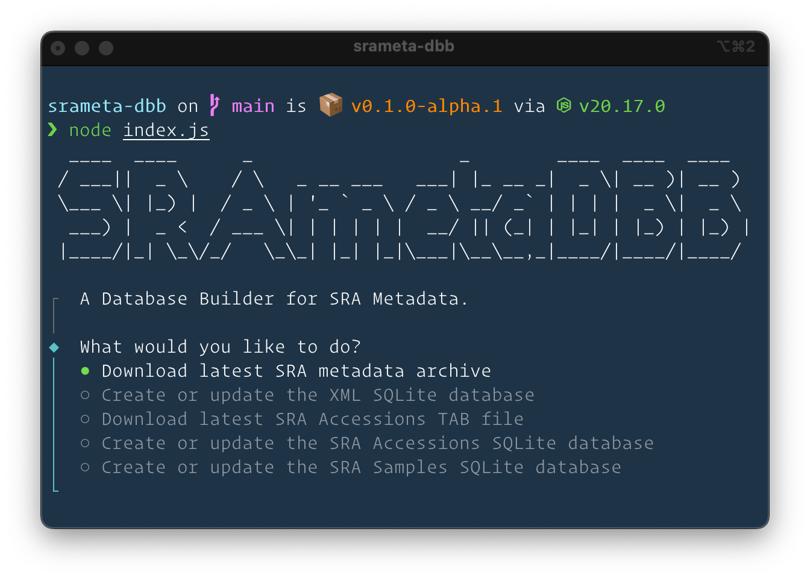

> [!WARNING]
> This tool is a hackathon project and is still a work in progress. It has not been thoroughly tested in production environments, and significant breaking changes may occur. This is a pre-release, serving as a proof of concept, and it is not recommended for use in any critical or production use cases.

**SRAmetaDBB** is an open-source pipeline for generating and updating an SQLite database that aggregates the Sequence Read Archive (SRA) metadata. This project aims to provide an efficient and versatile tool for accessing SRA metadata offline, enabling researchers to perform data analysis and exploration with ease.



## Background

**SRAmetadb.sqlite** is an SQLite database that aggregates the Sequence Read Archive (SRA) metadata into an offline SQLite database. This database has been a key resource for the SRAdb R package and the pysradb Python CLI tool, enabling users to query SRA metadata efficiently. However, the SRAmetadb.sqlite database has not been updated frequently, with the last known update occurring in late 2023. Moreover, no public tools are currently available to rebuild or update this database.

**SRAmetaDBB**, tried to address this gap by providing an open-source pipeline for generating and updating a similar **SRAmetadb.sqlite** database from SRA metadata. Our goal is to create a tool that prioritizes low resource usage and ease of maintenance while being as compatible as possible with the original SRAmetadb.sqlite database. Additionally, we aim to explore the potential of modern SQLite features to adapt to emerging use cases.

## Rationale

- **Versatility**: The **SRAmetadb.sqlite** database holds value beyond its use in the SRAdb R package. It can be utilized by other tools and languages, such as DuckDB, to unlock new possibilities for data analysis.
- **Customizability**: The project introduces the ability to generate subsets of SRA metadata, for example, focusing on specific species, which allows for more tailored data analysis.
- **Efficiency**: Offline access to SRA metadata significantly enhances the speed of querying and analysis, making it a valuable resource for researchers working in environments with limited or no internet access.
- **Adaptability**: The project is designed to adapt to emerging use cases, including Large Language Models (LLMs) and Retrieval-Augmented Generation (RAG) applications.

## Directions

- **Resource Efficiency**: This project focuses on minimizing resource usage and ensuring ease of maintenance and updates rather than solely optimizing the speed of database generation.
- **Compatibility**: While this pipeline is not intended to be a drop-in replacement for the original **SRAmetadb.sqlite**, it aims to maintain as much compatibility as possible. It also aims to leverage modern SQLite features where beneficial.
- **Open-Source Pipeline**: By making this pipeline open-source, we invite contributions and collaboration from the community to enhance its functionality, maintain its relevance, and address emerging needs in SRA metadata analysis.


## Usage

To run this pipeline, you can use **Node.js 20 LTS**. Follow these steps:

1. Clone the repository to your local machine.
2. Navigate to the project directory.
3. Install the necessary dependencies:
   ```bash
   pnpm install
   # or
   npm install
   ```
4. Run the pipeline:
   ```bash
   node index.js
   # or
   pnpm run start
   ```


## Sample Output

The following sample data files were generated using the DRAmetaDBB tool. You can download these files for reference or testing purposes.

  - **SRA Accessions SQLite Database**
     *Description*: A SQLite database containing SRA Accession IDs derived from an SRA Accessions TAB file. This database is a proof of concept and part of ongoing experimental efforts to explore the potential of using SQLite to store and query SRA metadata.
     *Download Link*: [SRA Accessions SQLite Database](https://zenodo.org/doi/10.5281/zenodo.13501385)

  - **SRAmetadb XML SQLite**
     *Description*: An SQLite database storing all XMLs from the SRA metadata dump file, providing easy access to SRA metadata in SQLite format. This database is a proof of concept and should be used for experimental purposes only.
     *Download Link*: [SRAmetadb XML SQLite](https://zenodo.org/doi/10.5281/zenodo.13502652)
